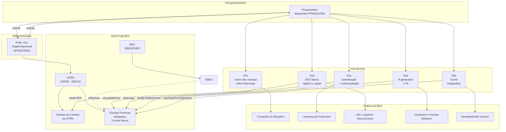
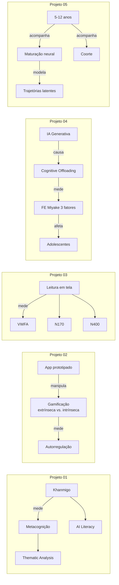
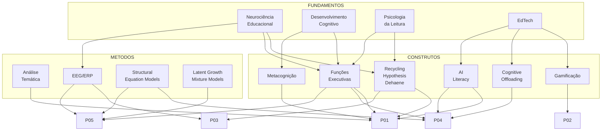
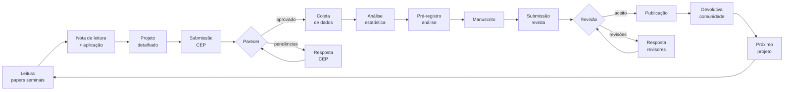
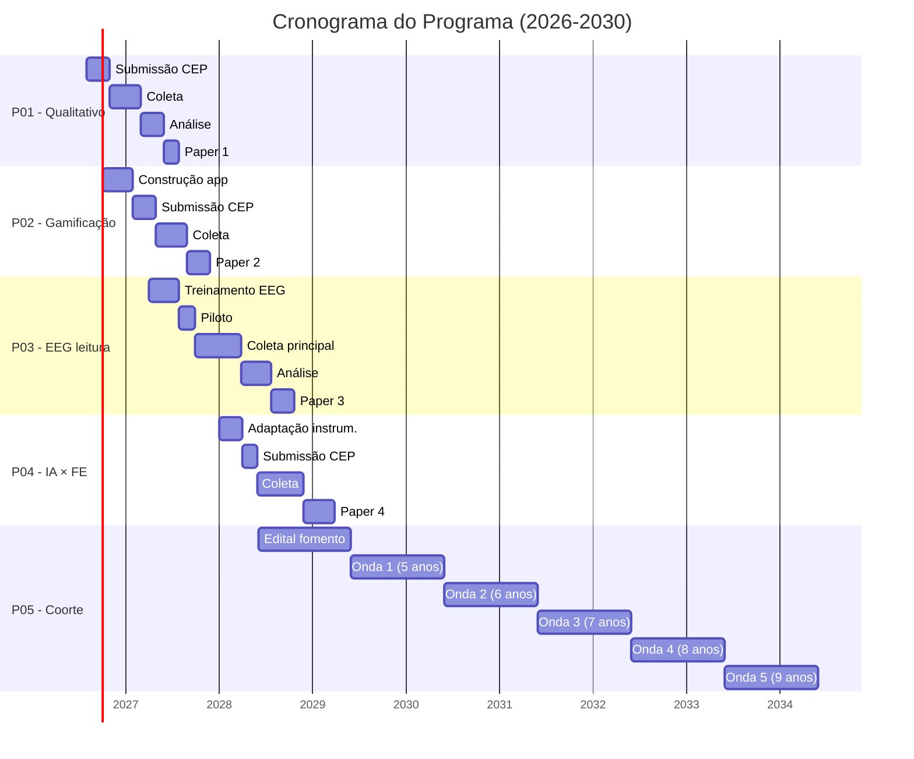

# 🗺️ Mapa Conceitual do Programa (Mermaid)

> **Visualização** das conexões entre os 5 projetos, papers, conceitos, e instituições parceiras.
> **Formato:** Mermaid (renderiza em GitHub, Notion, Obsidian, VS Code, etc.)
> **Uso:** compartilhar com a Angela, em slides, em papers como "framework figure".

---

## 🧭 Mapa-mestre (versão 1: projetos × instituições)

---

## 🧠 Mapa 2: conceitos-chave por projeto

---

## 📚 Mapa 3: papers × projetos (relevância)

```mermaid
graph TB
    subgraph PAPERS
        D1[Dehaene 2010<br/>Reading in the Brain]
        D2[Diamond 2013<br/>Executive Functions]
        D3[Miyake 2000<br/>Unity of EF]
        D4[Hamari 2014<br/>Gamification]
        D5[Luck 2014<br/>ERP Technique]
        D6[Naschold 2017<br/>L+N]
        D7[Braun & Clarke 2022<br/>Thematic Analysis]
        D8[Mollick 2024<br/>Co-Intelligence]
        D9[Howard-Jones 2014<br/>Neuro + Ed]
        D10[Snowling & Hulme 2020<br/>Science of Reading]
    end

    subgraph PROJETOS
        P01[P01]
        P02[P02]
        P03[P03]
        P04[P04]
        P05[P05]
    end

    D1 -->|forte| P01
    D1 -->|forte| P03
    D1 -->|média| P05

    D2 -->|forte| P01
    D2 -->|forte| P04
    D2 -->|média| P05

    D3 -->|forte| P04
    D3 -->|média| P05

    D4 -->|forte| P02

    D5 -->|forte| P03
    D5 -->|forte| P05

    D6 -->|forte| P01
    D6 -->|forte| P02
    D6 -->|média| P05

    D7 -->|forte| P01

    D8 -->|forte| P01
    D8 -->|forte| P04

    D9 -->|transversal| P01
    D9 -->|transversal| P02
    D9 -->|transversal| P03
    D9 -->|transversal| P04
    D9 -->|transversal| P05

    D10 -->|forte| P01
    D10 -->|média| P03
    D10 -->|média| P05
```

---

## 🔬 Mapa 4: arcabouço teórico (relação entre conceitos)

---

## 🧬 Mapa 5: pipeline de pesquisa (workflow)

---

## 🎯 Mapa 6: arcabouço temporal (5 anos)

---

## 🛠️ Como usar esses mapas

1. **No GitHub:** abra o `.md` direto, GitHub renderiza Mermaid automaticamente
2. **Em slides:** exporte o Mermaid como PNG (https://mermaid.live/)
3. **Em paper:** exporte como figura vetorial
4. **Em reunião com a Angela:** use o Mapa 1 ou 2 para apresentar
5. **Em GitHub Projects:** use como referência visual

---

> **Para editar:** abra no https://mermaid.live/ — tem editor visual + preview em tempo real.
