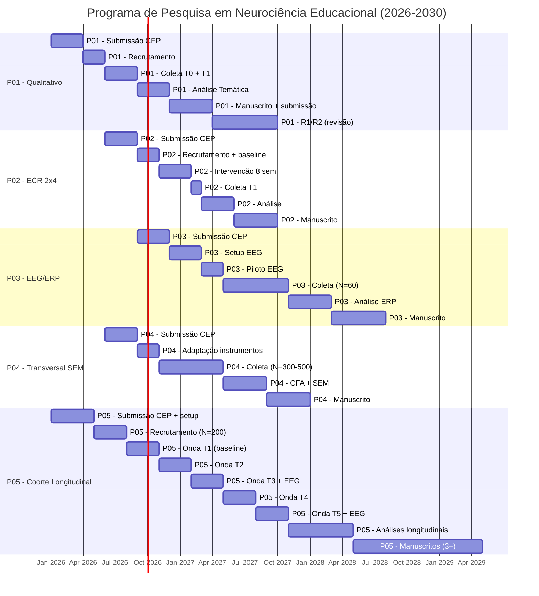
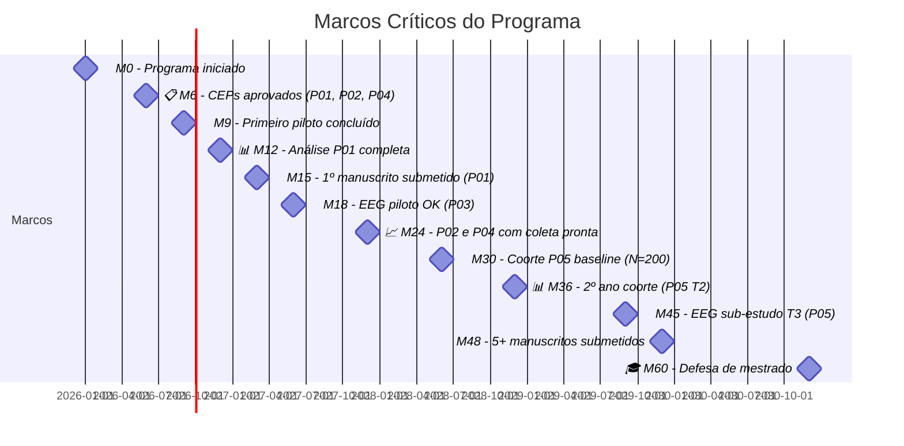
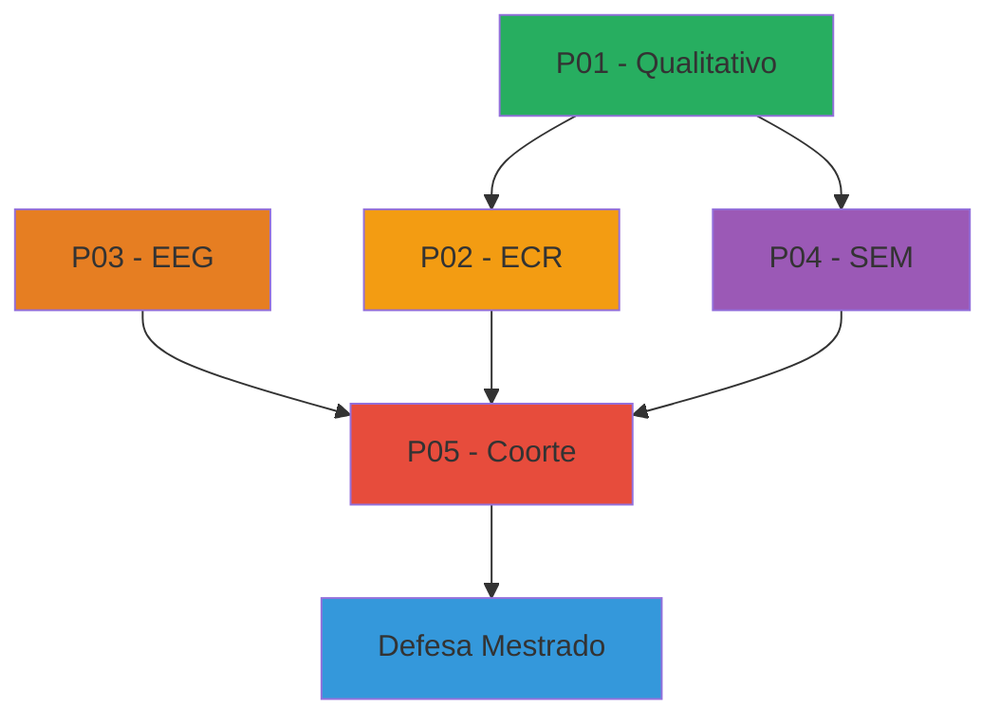

# 📅 Roadmap Visual do Programa (Mermaid Gantt)

> **Programa:** Neurociência Educacional 2026-2030
> **Período total:** 60 meses
> **Atualizado:** 2026-08-06

## 🎯 Visão geral (Gantt Mermaid)

## 📊 Marcos críticos (Milestones)

## 🔄 Dependências entre projetos

## 📈 Marcos anuais

| Ano | Marcos principais |
|---|---|
| **2026** (M0-M12) | Setup + CEPs + P01 piloto + P02 setup + P05 baseline |
| **2027** (M13-M24) | P01 manuscrito + P02 coleta + P03 EEG piloto + P04 coleta |
| **2028** (M25-M36) | P02 manuscrito + P04 manuscrito + P03 coleta + P05 T2/T3 |
| **2029** (M37-M48) | P03 manuscrito + P05 T4 + EEG + manuscritos longitudinais |
| **2030** (M49-M60) | P05 T5 + EEG + manuscritos finais + defesa |

## ⚠️ Riscos críticos

| Risco | Probabilidade | Impacto | Mitigação |
|---|---|---|---|
| CEP atrasar | Média | Alto | Submissão antecipada; carta de justificativa |
| Attrition P05 | Alta (24% em 5 anos) | Alto | N inicial 250; estratégias retenção |
| Recrutamento lento | Média | Alto | 5+ escolas; parcerias múltiplas |
| Equipamento EEG quebrar | Baixa | Alto | Backup com 2 sistemas; seguro |
| Perda de orientadora | Baixa | Crítico | Co-orientação; comitê independente |

## 💰 Orçamento estimado (parcial)

| Item | Valor (R$) | Período |
|---|---|---|
| Bolsas (CAPES) | 84.000 | 24 meses |
| Material escolar (participantes) | 15.000 | 5 anos |
| EEG (manutenção + periféricos) | 20.000 | 5 anos |
| Software (MNE, R, etc) | 5.000 | 5 anos |
| Congressos | 25.000 | 5 anos |
| **Total** | **~150.000** | **5 anos** |
