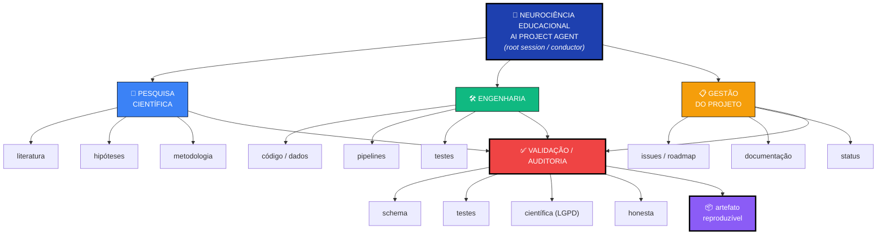
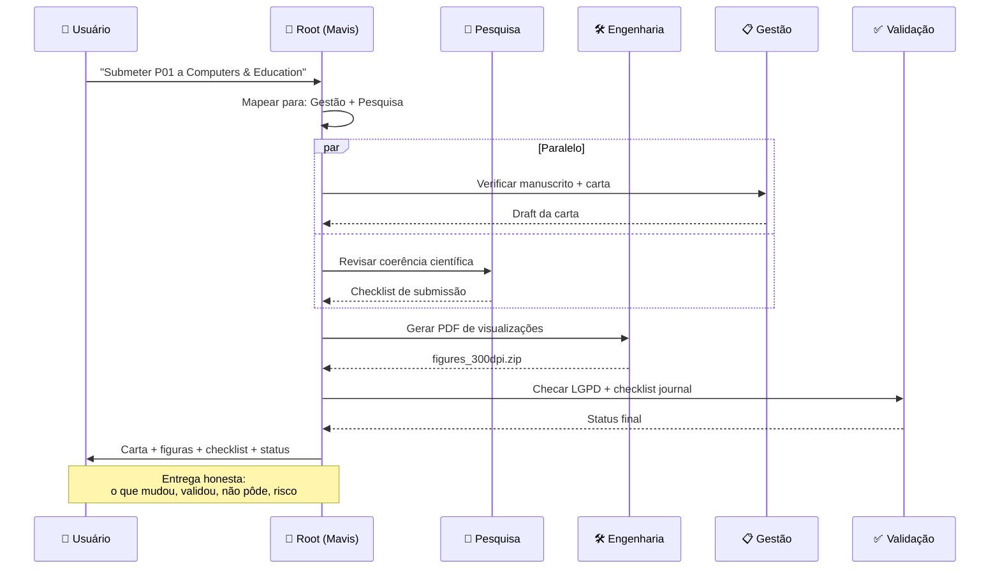
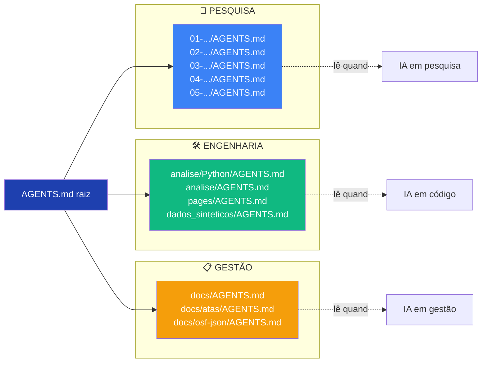

# 🏛️ Arquitetura AI — Diagrama Visual

> **Diagrama oficial** do AI Project Agent do Neurociência Educacional.
> Renderiza automaticamente em GitHub, GitLab, MkDocs, e Mermaid Live Editor.
> **Versão:** 1.0 — 2026-09-19

---

## 🎯 Diagrama principal (Mermaid)



---

## 🔄 Fluxo de trabalho típico



---

## 🔀 Mapa Domínios ↔ AGENTS.md



---

## 📦 Saídas reproduzíveis

```mermaid
graph TD
    V["✅ Validação completa"]
    
    V --> A1["📄 PDF relatório"]
    V --> A2["🌐 Dashboard"]
    V --> A3["📊 Figura 300dpi"]
    V --> A4["📋 Tabela CSV"]
    V --> A5["🔗 Pré-registro OSF"]
    V --> A6["📝 Manuscrito"]
    V --> A7["📜 Ata"]
    
    A1 -.seed=42.-> REPRO["🔁 Reproduzível"]
    A2 -.git+pages.-> REPRO
    A3 -.notebook.-> REPRO
    A4 -.pipeline.-> REPRO
    A5 -.osf_submit.py.-> REPRO
    A6 -.Quarto+manual.-> PARCIAL["⚠️ Parcial"]
    A7 -.humano-espec.-> NAO["❌ Não"]
    
    style V fill:#EF4444,color:#fff
    style REPRO fill:#10B981,color:#fff
    style PARCIAL fill:#F59E0B,color:#fff
    style NAO fill:#6B7280,color:#fff
```

---

## 📊 Métricas da arquitetura atual

| Métrica | Valor |
|---|---|
| **Domínios** | 3 (Pesquisa, Engenharia, Gestão) |
| **Sub-áreas por domínio** | 3 cada = 9 |
| **AGENTS.md arquivos** | 11 |
| **Skills carregáveis** | 20+ |
| **Outputs reproduzíveis** | 6 tipos |
| **Validações** | 4 tipos |
| **Linhas de orquestração** | ~300 (este doc) |

---

## 🔗 Links

- [`docs/AI-ARCHITECTURE.md`](AI-ARCHITECTURE.md) — versão completa em texto
- [`AGENTS.md`](../AGENTS.md) — visão geral
- [`docs/AGENTS-SYSTEM.md`](AGENTS-SYSTEM.md) — sistema multi-AGENTS

---

**Última atualização:** 2026-09-19
